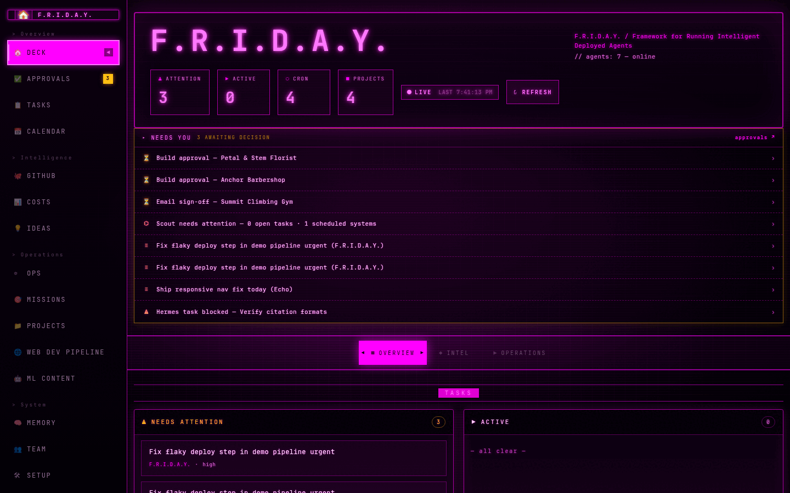
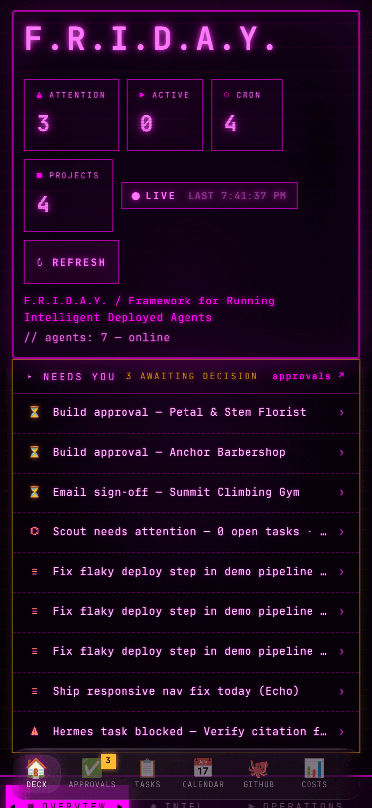
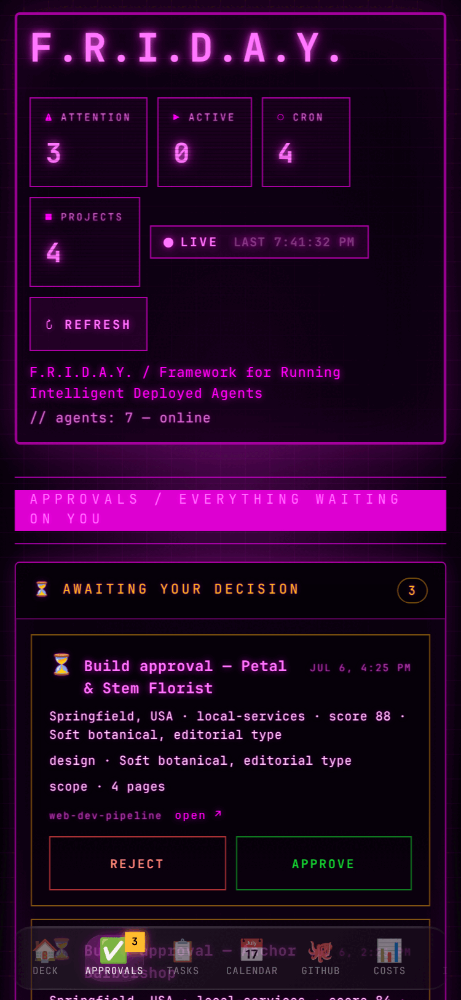
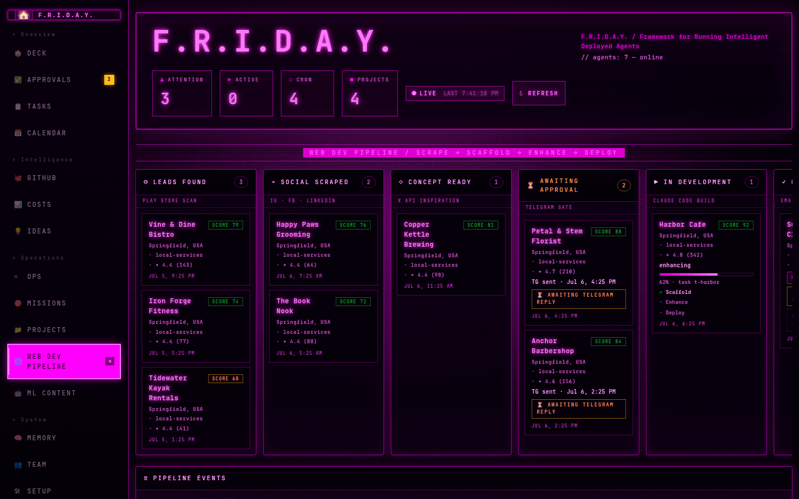
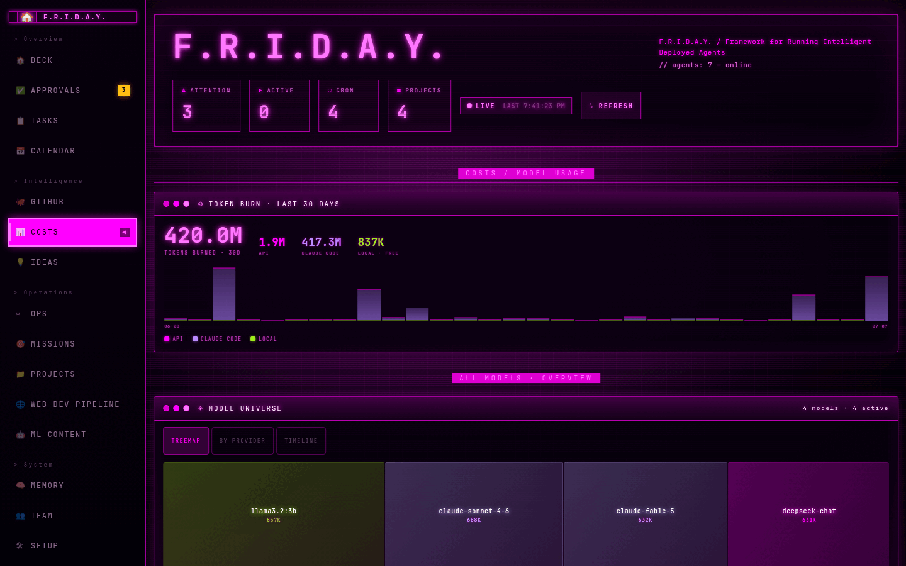

# Preciado Tech Mission Control

**Mission Control for your AI agents** — a local-first operational dashboard for the AI agents that run your work and your life.



   

## In three lines

Your agents already write their state to disk — task queues, session logs, cron schedules, pipeline stores. Mission Control turns that into one glanceable command deck: what's running, what broke, what it costs, and **what's waiting on you**. Everything stays on your machine; the only keys involved are your own.

## The Flight Director methodology

The dashboard is built on a simple operating pattern we call **Flight Director**: agents do the flying, you make the calls.

1. **Own your agents.** They run on your hardware, under your command — not on someone else's platform.
2. **Review all work.** Outbound work passes a **Go/No-Go gate** — the approvals inbox is the heart of the dashboard, not an afterthought.
3. **Keep your keys local.** Bring-your-own keys, stored in a gitignored file in this folder. Never synced, never logged, never returned by an API.

## What it is — and isn't

| ✅ It is | ❌ It isn't |
|---|---|
| A **dashboard/control-plane** for agents you already run | An agent framework or orchestrator (that's the [roadmap](#roadmap)) |
| **Local-first** — reads files and localhost services | A SaaS, or anything that phones home |
| **Read-mostly** — the one write path is your approval decisions | A tool that acts on your behalf without a gate |
| Configurable via a **/setup page** in the browser | A YAML wrestling match |

## Get started

| Step | Command | Time |
|---|---|---|
| 1. Clone | `git clone https://github.com/michaelpreciado/preciado-tech-mission-control.git && cd preciado-tech-mission-control` | 30s |
| 2. Launch with demo data | `./start.sh --demo` | ~2 min |
| 3. Explore | Browser opens a fully populated deck — approvals, pipeline, costs, tasks | 2 min |
| 4. Make it yours | Open **/setup**, point the paths at your own agents' files, add keys | ~5 min |

Requires **Node.js ≥ 22**. The demo seed (`npm run seed-demo`) fills the board with realistic fake data — an empty dashboard is hard to appreciate. When you're ready, `/setup` writes `data/config.json` (gitignored) and the collectors pick it up live, no restart.

<p align="center">
  
  
  
</p>

## What's on the deck

- **Deck** — live stats, a "NEEDS YOU" strip of everything awaiting a decision, scheduler, system health
- **Approvals** — the Go/No-Go inbox: pipeline gates, email sign-offs, blocked tasks, one-tap approve/reject
- **Tasks** — a read-only window into your agents' kanban DB (SQLite), with live SSE updates
- **Calendar** — every scheduled job with next/last run, plus optional Google Calendar events
- **Chat** — talk to your agents through your local gateway
- **GitHub** — contributions heatmap, repo grid, and recent events via your own `gh` CLI
- **Costs** — 30-day model burn across providers (session JSONL logs + optional OpenRouter live billing)
- **Projects** — active repos, workspaces, and vault projects with task counts
- **Pipeline** — 6-stage lead-to-launch kanban fed by an external skill; the board renders, agents act
- **ML Content** — script → film → edit → post content production board
- **Memory** — recent promotions from your agents' memory files and notes vault
- **Team** — the agent crew: live office floor, status, and per-agent cards
- **Setup** — configure everything from the browser; unconfigured integrations show "connect" cards, never broken widgets



## Architecture

```
            ┌─────────────────────────────────────────────┐
            │         Mission Control (Next.js)          │
            │                                             │
  Browser ──►  pages ── /api/* collectors ── lib/config   │
            │                │                    │       │
            └────────────────┼────────────────────┼───────┘
                             │ reads (mostly)     │ env > data/config.json > defaults
             ┌───────────────┼───────────────┐
             ▼               ▼               ▼
      kanban.db (SQLite)  session JSONL   pipeline.json / events.jsonl
      cron jobs.json      notes vault     localhost services (SSE bus, Ollama, …)
```

Your agents **write**; Mission Control **renders**. Every collector degrades gracefully — a missing file or dead service means an empty panel, never a crash. The single write path back into agent-land is the approvals gate.

## Configuration

Everything is configurable three ways, in order of precedence: **env var → `data/config.json` (written by /setup) → sane default**. See [`.env.example`](.env.example) for the fully documented surface. Highlights:

| Setting | Purpose |
|---|---|
| `NEXT_PUBLIC_APP_NAME` | Rebrand the whole UI |
| `INTERNAL_API_SECRET` | Require a bearer token on all write endpoints (recommended beyond localhost) |
| `OPENROUTER_API_KEY` | Live billing on the Costs tab (server-side only) |
| `MC_HERMES_KANBAN_DB`, `MC_PIPELINE_DIR`, `FRIDAY_*` | Point collectors at your agents' files |

## Cost & transparency

Mission Control itself costs nothing to run — it's a Next.js app reading your local files. It makes **zero** network calls except: the optional OpenRouter billing check (your key, server-side), optional GitHub stats via your own authenticated `gh` CLI, and optional Google Calendar via your own service account. No telemetry, no analytics, no accounts.

## Directory structure

```
app/            pages + API routes (collectors)
components/     UI (Shell, boards, panels)
lib/            config resolution, data layer, canonical event schema
scripts/        seed-demo.mjs — the demo dataset generator
data/           YOUR local data: config.json, demo/, runtime stores (gitignored)
docs/           screenshots
start.sh       one-command startup
```

## Security posture

- Keys flow env/config → server runtime only; never logged, never in `NEXT_PUBLIC_*`, never echoed by any API
- Write endpoints are loopback-only by default; set `INTERNAL_API_SECRET` to expose beyond localhost
- Setup input is validated (typed whitelist, length caps); config file written `0600`
- Strict CSP + security headers ship on by default (see `next.config.ts`)

## Roadmap

v1 is deliberately **just the dashboard**. Planned next:

- Built-in starter agents (research, outreach, monitoring) you can enable per-machine
- A generalized event-bus contract so any agent framework can plug into the deck
- Tool/skill marketplace
- Multi-user / auth for small teams

## Star history

[](https://star-history.com/#michaelpreciado/preciado-tech-mission-control&Date)

## License

[MIT](LICENSE) — built by [Michael Preciado](https://github.com/michaelpreciado). If Mission Control runs your crew, I'd love to hear about it.
